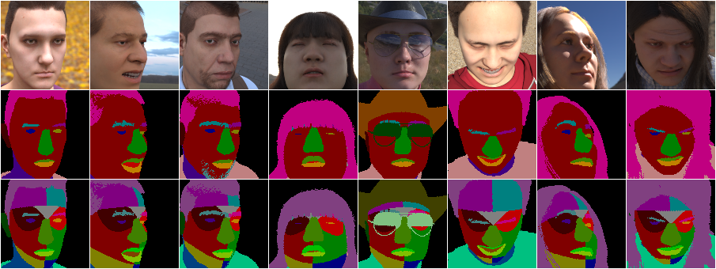

# FSErasing: Improving Face Recognition with Data Augmentation Using Face Parsing

## Introduction
We proposes a data augmentation method, called *Face Semantic Erasing (FSErasing)*, for face recognition using face parsing.
Face recognition models are trained with face images erased random face semantic regions such as hair, cheek, forehead, nose, and eye.
We also propose the original face semantic labels with 25 classes, which include 9 additional classes: ``right_cheek``, ``left_cheek``, ``right_chin``, ``left_chin``, ``right_forehead``, ``left_forehead``, ``middle_forehead``, ``around_right_eye``, ``around_left_eye``.

This repository contains the following used for the results in [our paper]():
- implementation of FSErasing
- implementation of the visualization method for face recognition models using face parsing, which called *Face Semantic Class Activation Mapping (FS-CAM)* in this repositoty
- our original semantic labels with 25 classes for detailed face parsing

## Requirements
- Python 3.x (recommended >= 3.8.8)
- pytorch (recommemded >= 1.8.1)
- pandas (recommended >= 1.2.4)
- opencv-python (recommended >= 4.5.1.48)
- scipy (recommended >= 1.6.2)
- scikit-learn (recommended >= 0.24.1)
- tqdm (recommended >= 4.60.0)

## Dataset
### Downloading the dataset
You can download the detailed face semantic labels (with 25 classes) for [FaceSynthetics dataset](https://github.com/microsoft/FaceSynthetics) [^1] from the link below.

[Google Drive](https://drive.google.com/file/d/1cmxnd9dtWsoLiO21zJ6GF-cgZPdH1IHB/view?usp=share_link) (739MB, unzip: 1.1GB)


Note that the face images and landmark labels are **NOT** included in our distributed files.
They are available for download at the official GitHub repository of [FaceSynthetics](https://github.com/microsoft/FaceSynthetics) (full dataset of 100,000 images).

### Dataset layout
The detailed face semantic labels are contained in a single .zip file.
We recommend that move the unzipped files and folders: ``labels25``, ``labels8``, ``anno_list.csv`` into the folder downloaded at the official repository of FaceSynthetics.

```
detailed_facesynthetics.zip
├── labels_25
|   └── {frame_id}_seg.png   # Segmentation image, where each pixel has an integer value mapping to the categories below (0 to 24)
├── labels_9
|   └── {frame_id}_seg.png   # Segmentation image, where each pixel has an integer value mapping to the categories below (0 to 9)
└── anno_list.csv            # .csv file, described the frame ID and abailability of our detailed labels with 25 classes
```

The .csv file has table data with 2 columns and 100,000 rows, like the following. 

| frame_id | with_25 |
| :---: | :---: |
| 0 | 1 |
| 1 | 1 |
| ... | ... |
| 10 | 0 |
| 11 | 1 |
| 12 | 0 |
| ... | ... |
| 99999 | 1 |

Our detailed labels are automatically annotated based on the 468 landmarks estimated using [Face Mesh (Google Mediapipe)](https://google.github.io/mediapipe/solutions/face_mesh.html) [^2], and there are 11,916 images for which annotation failed due to landmark detection errors or other reasons.
More information is available from our paper.
Then, you can get the list of paths of images and detailed semantic labels with 25 classes by running the following commands.

```python
import pandas as pd

df = pd.read_csv('anno_list.csv')
id_list = df[df['with_25'] == 1]['frame_id'].values

image_paths = [f'./images/{x:06d}.png' for x in id_list]         # list of paths of 88,084 images
label_paths = [f'./labels25/{x:06d}_seg.png' for x in id_list]   # list of paths of 88,084 detailed labels with 25 classes
```

### Class index assignment
The int value of each pixel in the segmentation image assigned accorsing to the following table.

| value (class ID) | class name |
| :---: | :---: |
| 0 | *Background* |
| 1 | *Right_cheek* |
| 2 | *Left_cheek* |
| 3 | *Right_chin* |
| 4 | *Left_chin* |
| 5 | *Right_forehead* |
| 6 | *Left_forehead* |
| 7 | *Middle_forehead* |
| 8 | *Around_right_eye* |
| 9 | *Around_left_eye* |
| 10 | *Nose* |
| 11 | *Right_eye* |
| 12 | *Left_eye* |
| 13 | *Right_blow* |
| 14 | *Left_blow* |
| 15 | *Right_ear* |
| 16 | *Left_ear* |
| 17 | *Mouth* |
| 18 | *Upper_lip* |
| 19 | *Lower_lip* |
| 20 | *Neck* |
| 21 | *Hair* |
| 22 | *Clothing* |
| 23 | *Glasses* |
| 24 | *Headware* |


## Pre-trained face parsing model
The pre-trained face parsing model is available from the link below.

[Google Drive](https://drive.google.com/file/d/12POo4ZgcuQlPOS9Cjd5O7GIxbSW36jV7/view?usp=share_link) (443MB)


The network architecture is based on U-Net [^3], which encoder is replaced ResNet-18 [^4].
The model is trained using 88,084 face images in FaceSythetics dataset [^1] with our detailed semantic labels.
If you want to obtain more details of experimental conditions, please check Section 5.1.2 in our paper.

Note that the images and labels used for training are aligned using similarity transformation based on 5 facial landmarks and size of 112 × 112 pixels.
The alignment method is followed the general one for face recognition, such as introduced at [insightface](https://github.com/deepinsight/insightface/blob/607b026481dbf7d7191b638078e4f0c4c968b744/recognition/arcface_torch/eval_ijbc.py).


## Sample codes
### FSErasing sample


### FS-CAM sample


[^1]: E. Wood, T. Baltrusaitis, C. Hewitt, S. Dziadzio, T.J. Cashman, and J. Shotton, "Fake It Till You Make It: Face analysis in the wild using synthetic data alone," Proc. Int'l Conf. Computer Vision (ICCV), pp. 3681--3691, Oct. 2021.

[^2]: Y. Kartynnik, A, Ablavatski, I. Grishchenko, and M. Grundmann, "Real-time facial surface geometry from monocular video on mobile GPUs," arXiv, abs/1907.06724, Jun. 2019.

[^3]: O. Ronneberger, P. Fischer, and T. Brox, "U-Net: Convolutional networks for biomedical image segmentation," Proc. Int'l Conf. Medical Image Computing and Computer Assisted Intervention, Springer, LNCS, vol. 9351, pp. 234--241, Oct. 2015.

[^4]: K. He, X. Zhang, S. Ren, and J. Sun, "Deep residual learning for image recognition," Proc. IEEE Conf. Computer Vision and Pattern Recognition, pp. 770--778, Jun. 2016.
